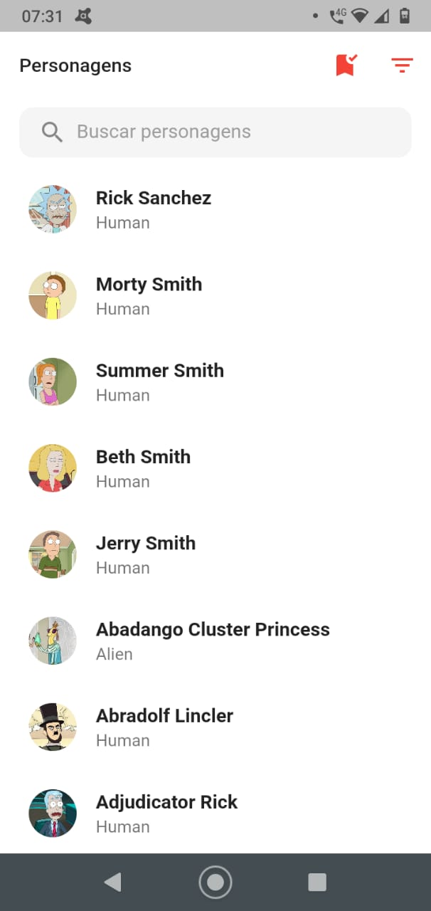
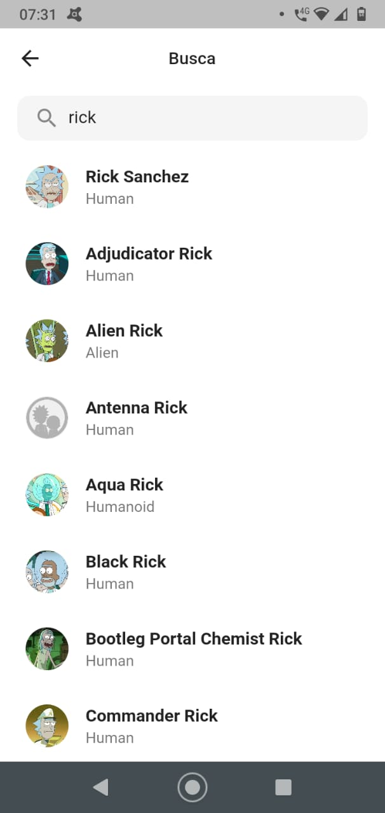
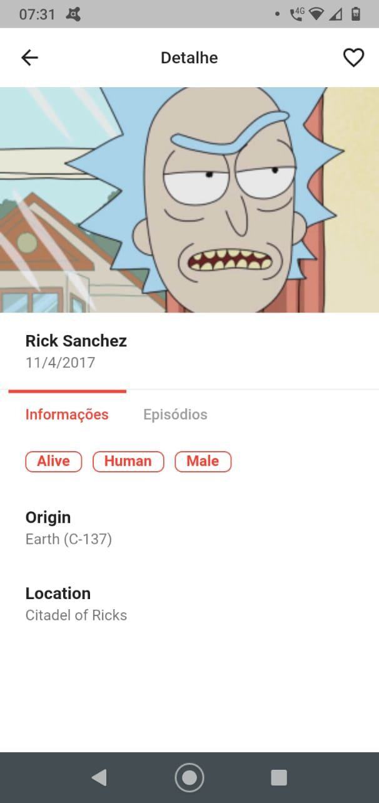
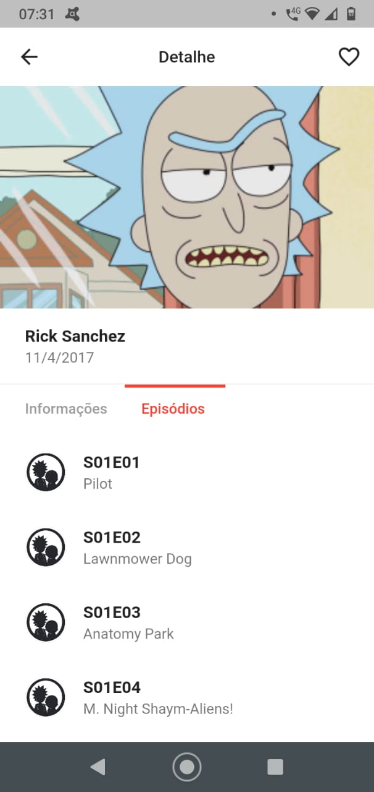
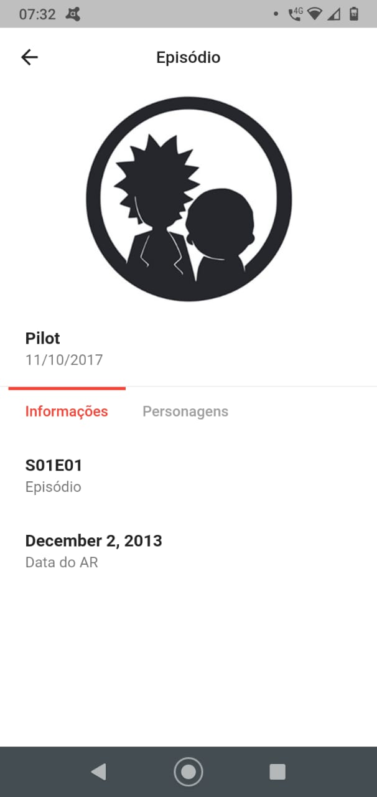
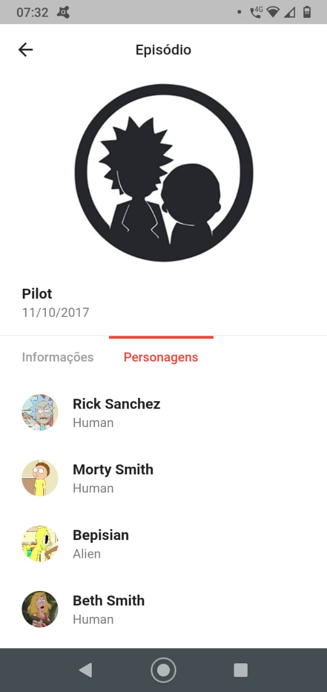
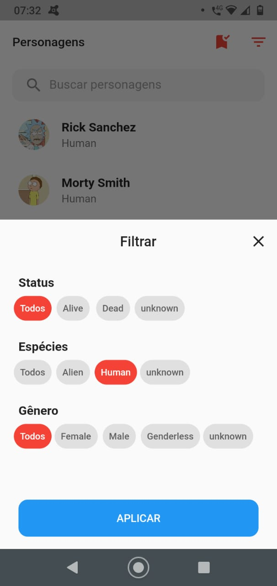
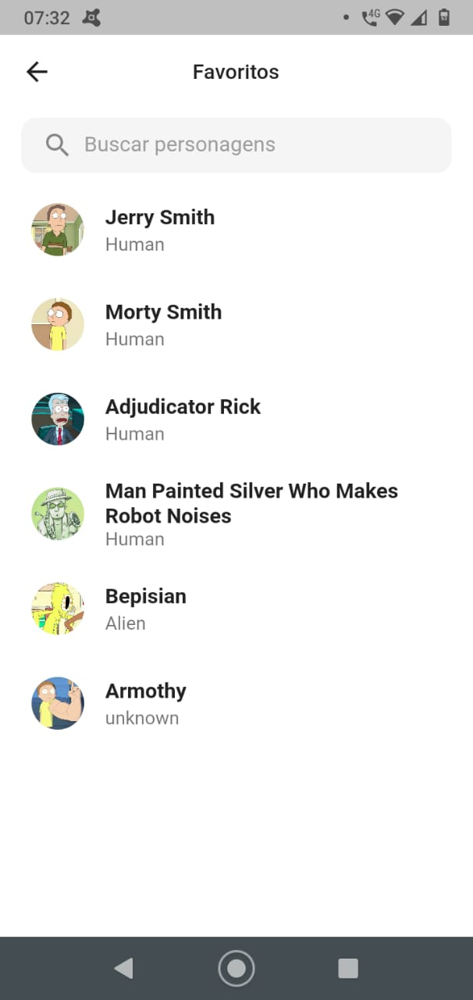

# Flutter Rick and Morty 

App em flutter consumindo [API The Rick and Morty](https://rickandmortyapi.com/).

Monorepo para projetos frontend utilizando

- [Nx Workspace](https://nx.dev/) 14.8.6
- [Flutter](https://flutter.dev/) 3.0.5
- Dart 2.17.6
- Node 16.16.0
- Npm 8.11.0

## Dependências

- [dio](https://pub.dev/packages/dio) 4.0.6
- [flutter_modular](https://pub.dev/packages/flutter_modular) 5.0.3
- [flutter_mobx](https://pub.dev/packages/flutter_mobx) 2.0.6+4
- [flutter_svg](https://pub.dev/packages/flutter_svg) 1.1.5
- [intl](https://pub.dev/packages/intl) 0.17.0
- [mobx](https://pub.dev/packages/mobx) 2.1.1
- [shared_preferences](https://pub.dev/packages/shared_preferences) 2.0.15
- [skeletons](https://pub.dev/packages/skeletons) 0.0.3

## Funcionalidades

- Lista dos personagens com seus respectivos nomes e fotos
- Busca por personagens (Nome)
- Filtro que permite listar todos, só humanos ou só aliens, status e gênero
- Visualização detalhada do personagem
- Lista de favoritos e adicionar/remover personagens
- Visualização detalhada do episódio

## Configurações iniciais

> 💡 Garanta que seu Node esteja na versão 16x, para uma melhor compatibilidade e integração

Na raiz do repositório execute o comando

```bash
npm install
```

Antes de executar o projeto, execute os comandos

```bash
nx run flutter-rick-morty:clean
```

Para iniciar o aplicativo em desenvolvimento, execute o comando

```bash
npx nx run flutter-rick-morty:run
```

---

## Comandos úteis

Todos os comandos rodam no NX CLI instalado no workspace.

Caso estela com algum problema com o comando local você pode acionar pelo `npx`

| COMANDO | DESCRIÇÃO |
| ------- | --------- |
| `nx run flutter-rick-morty:analyze` | Analise o código Dart do projeto |
| `nx run flutter-rick-morty:clean` | Excluir os diretórios `build/` e `dart_tool/` |
| `nx run flutter-rick-morty:format` | Formate um ou mais arquivos Dart |
| `nx run flutter-rick-morty:test` | Execute testes de unidade Flutter para o projeto atual |
| `nx run flutter-rick-morty:doctor` | Execute o Flutter doctor para verificar o ambiente e o status da instalação do Flutter |
| `nx run flutter-rick-morty:assemble` | Montar e construir recursos Flutter |
| `nx run flutter-rick-morty:attach` | Anexar a um aplicativo em execução |
| `nx run flutter-rick-morty:drive` | Execute testes de integração para o projeto em um dispositivo ou emulador conectado |
| `nx run flutter-rick-morty:gen-l10n` | Gerar localizações para o projeto atual |
| `nx run flutter-rick-morty:install` | Instale um aplicativo Flutter em um dispositivo conectado |
| `nx run flutter-rick-morty:run` | Execute seu aplicativo Flutter em um dispositivo conectado |
| `nx run flutter-rick-morty:build-aar` | Construir um repositório contendo um AAR e um arquivo POM |
| `nx run flutter-rick-morty:build-apk` | Crie um arquivo APK do Android a partir do seu aplicativo |
| `nx run flutter-rick-morty:build-appbundle` | Crie um arquivo Android App Bundle a partir do seu aplicativo |
| `nx run flutter-rick-morty:build-bundle` | Crie o diretório de ativos do Flutter a partir do seu aplicativo |
| `nx run flutter-rick-morty:build-ios` | Criar um pacote de aplicativos iOS (somente host Mac OS X) |
| `nx run flutter-rick-morty:build-ios-framework` | Produz um diretório .framework para um módulo Flutter e seus plugins para integração em projetos Xcode simples e existentes |
| `nx run flutter-rick-morty:build-ipa` | Criar um pacote de arquivos iOS (somente host do Mac OS X) |

### Exemplos

Serve a aplicação em modo desenvolvimento

```bash
nx run flutter-rick-morty:run
```

Execute os testes unitários do projeto

```bash
nx run flutter-rick-morty:test
```

Execute todos os testes unitários do repositório

```bash
nx run-many --target=test --all=true
```

## Workflows

Sempre que uma PR é aberta é iniciado um workflow de `CI` (Continuous Integration). Após ser criado um novo release é iniciado um workflow de `CD` (Continuous Delivery).

### CI - Continuous Integration

O `CI` auxilia em termos de segurança e confiabilidade no código desenvolvido, antes dele ser de fato mergeado. Onde é estressados cenários de testes, análises do código e formatação.

#### Jobs que são executados:

- prepare
- analyze
- test


### CD - Continuous Delivery

Esse workflow é responsável por buildar o aplicativo e gerar o `appbundle`

#### Jobs que são executados:

- prepare
- build_appbundle


## Integração com o gráfico de dependências

Através do comando `nx graph`, é possível visualizar as dependências de qualquer módulo. Ele abrirá um gráfico de dependência em um navegador. No menu do lado esquerdo, você pode escolher quais projetos deseja incluir na visualização. Após clicar em Select all, você deverá ver o seguinte gráfico:


| Personagens | Episódios | Splash |
| ----- | ----- | ----- |
|  |  |  |

| Commons | Shared |
| ----------- | ----- |
|  |  |
## Capturas de tela

| Personagens | Busca |
| ----------- | ----- |
|  |  |

| Detalhe/Informações | Detalhe/Episódios |
| ------------------- | ----------------- |
|  |  |

| Episódio/Informações | Episódio/Personagens |
| -------------------- | -------------------- |
|  |  |

| Filtros | Favoritos |
| -------------------- | -------------------- |
|  |  |
